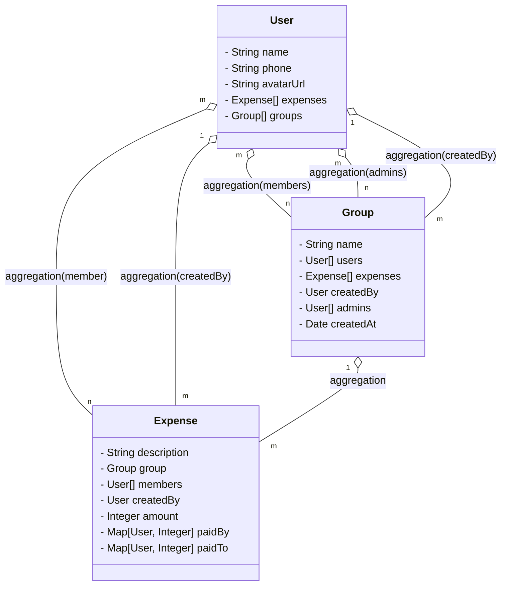

# SPLIT WISE

## Expense management application

### Requirements

```
* Users can register and update their profiles.
* A user's profile should contain at least their name, phone number and password
* Users can participate in expenses with other users
* Users can participate in groups.
* To add an expense, a user must specify
 - either the group,
 - or  the other users involved in the expense,
 - along with who paid what
 - and who owes what.
* They must also specify a description for the expense.
* A user can see their total owed amount
* A user can see a history of the expenses they're involved in
* A user can see a history of the expenses made in a group that they're participating in
* Users shouldn't be able to query about groups they are not a member of
* Only the user who has created a group (admin) can add/remove members to the group
* Users can request a settle-up. The application should show a list of transactions, which when executed will ensure that the user no longer owes or receives money from any other user. Note that this need not settle-up any other users.
* Users can request a settle-up for any group they're participating in.
* The application should show a list of transactions, which if executed, will ensure that everyone participating in the group is settled up (owes a net of 0 Rs).
* Note that it will only deal with the expenses made inside that group. Expenses outside the group need not be settled. Good to Have Requirements
* When settling a group, we should try to minimize the number of transactions that the group members should make to settle up.

```

Let's list the entities first

1. User
2. Expense
3. Group



- As User vs Expense is "m : n" relation, we should seperate class for Expense_User class.
- As User vs Group is "m : n" relation, we should create seperate class for User_Group class.
- As Expense can be part of individual or group, so there are equal chances, so it would have NULL, which makes it sparse. so we should create the Expense_Group class.
- As Admin vs Group relation is "m:n", we should create a seperate mapping table, i.e. we should create seperate class.

```java
class User{
	String name;
	String avatarUrl;
	String phone;
}
```
